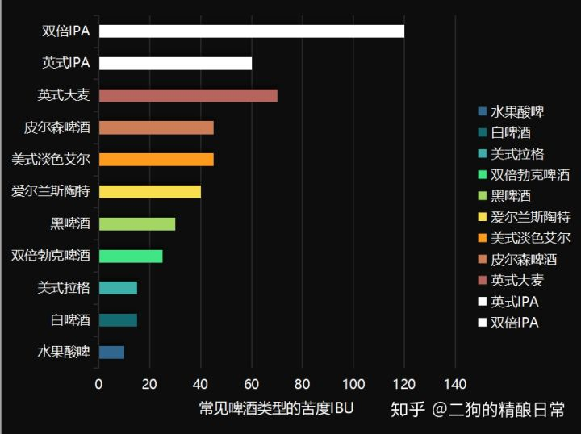

**啤酒的主要原料是什么？**
水、麦芽、啤酒花、酵母，辅料非常丰富，包括大麦以外谷物、香料，水果等等。
**啤酒主要分为艾尔（Ale）和拉格（Lager），他们有什么区别？**  
区别在于发酵用的酵母菌不同，也对应了不同的发酵工艺。  
艾尔酵母的发酵温度较高（15℃~25℃），酵母处于液面上部，短短三五天就可以完成一大桶啤酒的发酵。  
拉格酵母的发酵温度较低（4℃~12℃），酵母在桶底发酵，释放热量缓慢，需要15天甚至更久。  
**为什么市面上绝大部分的啤酒是拉格？**
历史上，拉格啤酒是一种很高级的啤酒，因为它需要很低的发酵和窖藏温度，仅仅是气候比较寒冷的德国和捷克可以利用地窖来酿造拉格啤酒。  
但是工业时代开始，低温不再是问题，拉格反而由于发酵缓慢、释放热量低变得更加适合大批量发酵，一个发酵罐可以做到几十吨的体量，这对艾尔而言是几乎不可能的。大规模生成让成本降低，导致了拉格的流行。我们大多数适合喝的啤酒，通常被叫做工业打了个，或者是美国淡色拉格，因为它们的工艺发源自美国。 
**生啤和熟啤是什么？**
生啤是只经过简单的过滤的散装啤酒，保留了活的酵母菌和其他活性成分，保质期只有3~7天。
熟啤则是经过了严格的灭菌之后的啤酒，保质期长，可以大规模生产。
具体细分：生啤包括扎啤、原浆、纯生等等，熟啤是主要的市场，被卖家取了很多名字，包括干啤、冰啤、普通熟啤等等，
- 扎啤：Jar Beeer，是一种重新加入了二氧化碳的生啤，通常装在大扎啤杯里引用。
- 干啤：命名方式来自葡萄酒的干红和干白，通过特殊酵母使糖继续发酵，糖含量大大降低，口味干爽，国家标准规定其发酵度不得低于72%。
- 冰啤：在出厂前让啤酒处于冰点温度，啤酒中的蛋白质就会和冰晶结合形成混浊悬浮，滤除后即可生产出非常清澈的啤酒。它的色泽特别清亮，口味更加醇厚柔和，但代价是由于过滤了部分冰晶，导致余下啤酒的酒精含量升高。
**什么是精酿啤酒？**
Craft beer，这是一个商业概念，区别于“工业啤酒”，指那些生产量较小的啤酒。
至于“注视质量，而不是数量”，我认为是一种商业宣传，按照它的逻辑，我完全可以把可口和百事之外的可乐叫做craft coke。

**啤酒瓶的颜色为什么绿色和棕色偏多？**
玻璃在制造过程中，会参杂亚铁离子，导致颜色发绿，在19世纪去除亚铁离子非常困难，所以玻璃颜色是绿色的，使用绿色也成为了一种传统。
使用棕瓶是因为波长在350~500nm的光线会让酒花中所含的异α-酸光解，产生臭味，可以用棕瓶或易拉罐避光。
绿瓶和蓝瓶的遮光效果远差于棕瓶，不过如果使用不会光解的酒花提取物，使用绿瓶、蓝瓶、透明瓶都可以。

**啤酒的度数怎么看？**
通常，啤酒会标记原麦汁浓度（wort concentration）和酒精度（Alcohol By Volume，ABV），单位分别是°P和%Vol，前者度量的是原麦汁中糖分含量，后者则是实实在在的酒精体积占比，通常指的度数是原麦汁浓度，国内的淡色拉格的酒精度一般在2~3%Vol左右。
原麦汁浓度有不同的单位，因为历史原因一般采用°P（Plato scale），和白酒使用的Brix scale基本一致。此外，还可以直接麦芽汁密度（Gravity）来度量，也就是采用糖类的相对质量和1单位质量水之和，这个值在酿造的不同阶段不一样，一般包括初始的original gravity (OG)和最终的 final gravity (FG)。
OG就对应原麦汁浓度，一般的转换方式为：
wort concentration (°P)=(OG-1)×1000÷4 
FG和OG的差值就代表着酵母菌消耗的糖类，可以基于此估算出酒精度：
ABV = (OG - FG) / 0.75
例如，OG = 1.048，FG = 1.012，对应原麦汁浓度 (1.048-1)×1000÷4=12°P，酒精度 ABV=(1.048-1.012)/0.75=4.8%

**啤酒的苦度怎么度量？**
啤酒花加热时产生的异构α酸是啤酒中的苦味的主要来源，不同啤酒的啤酒花使用量和添加方法差别很大，因此产生的苦度差距很大。  
苦度的度量单位是IBUs(International Bitterness Units)，1 IBU代表1L啤酒中含有1mg的异构α酸。
各类啤酒的苦度如下图所示，淡色拉格IBUs一般在10~20之间，苦度更低的有果啤、白啤，更高的有黑啤，世涛，IPA等等。
  
不同人对苦度的耐受能力不同，一般而言，高苦度的啤酒会蕴含着其他的香气和味道，这也是精酿啤酒的一大卖点。

**常见的啤酒细分种类有哪些？**
- 果啤
- 酸啤
- 白啤
- 黑啤
- 世涛
- IPA
- 帝国IPA
- 修道院啤酒
- 